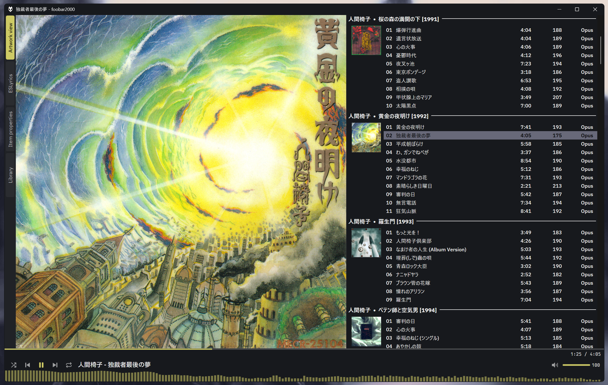

<h1 align="center">foo_bettertabs</h1>

<p align="center">
  A tab container for <a href="https://www.foobar2000.org/">foobar2000</a> v2, for Columns UI and the Default UI.<br />
</p>

<p align="center">
  
</p>

## Features

- **Works in both UIs.** A splitter in Columns UI and a container element in the Default UI. The
  same strip, menus and settings in both.
- **Strip on any side.** Top, bottom, left or right. Side strips can rotate their titles.
- **Look.** Underline, pill, tab, outlined tab or text-only indicator, optional chips, corner radius, tab width (fit the
  title, all equal or fill the strip) and alignment. Tabs can have an icon (Segoe Fluent Icons or
  emoji) and can show the icon only.
- **Hover style.** Hovered tabs can show a fill, an outline (any width, 1-8 DIPs), an underline or
  combinations, in the text colour, the accent or a custom colour, optionally fading in and out.
- **Accent colour** from the UI selection colour, the UI highlight colour (Default UI) or active
  item frame colour (Columns UI), a custom colour, or the playing track's cover. The
  strip background can follow the UI, be custom, or be tinted with the accent (a nearly grey cover leaves it untinted).
- **Titles** are the panel's own name, your text, or title formatting.
- **Auto-hide.** The strip appears when the pointer reaches a thin hot zone at the edge, over the
  panel or pushing it aside, with an optional slide or fade.
- **Switching.** Click, mouse wheel, Ctrl+Tab / Ctrl+Shift+Tab, the tab list, or automatically when
  playback starts or stops. Drag tabs to reorder them. Hide tabs you rarely use.
- **Multi-select.** Ctrl+click toggles a tab, Shift+click selects a range. Drag a selected tab to
  move the whole selection as one block (Esc cancels the drag). Click empty strip space or press Esc
  to clear the selection.
- **Light on resources.** Panels are created the first time their tab is shown, nothing runs while
  idle, and only the strip is painted. See [Performance](#performance).

## Install

Requires foobar2000 v2 on Windows 7 or later, 32-bit or 64-bit (the package contains both). Columns
UI is optional.

1. Download `foo_bettertabs.fb2k-component` from the [latest release](https://github.com/HongYue1/foo_bettertabs/releases/latest).
2. Double-click it, or in foobar2000 open **Preferences > Components > Install...**, and restart.

To remove it, use **Preferences > Components**.

## Use

### Columns UI

Add **Better Tabs** from Preferences > Columns UI > Layout (it is listed under *Splitters*). Add,
remove and reorder its panels there; each panel is one tab. Live layout editing works as well, and
FCL export and import keep the container's settings.

Size limits: Better Tabs is at least as large as its largest panel's minimum and may grow up to the
largest panel maximum. A page with a smaller maximum (for example an empty Playlist tabs) keeps its
own maximum size at the top left instead of shrinking the whole container. Columns UI's Tab stack
uses the smallest maximum instead.

### Default UI

In layout editing mode, add **Better Tabs** from *Containers*. It starts with one empty tab; click
it to pick an element.

While layout editing is on:

- Right-click an element for the standard menu plus **Rename tab**, **Remove tab** and **Configure
  Better Tabs**.
- Right-click the strip for **Add new tab** and **Paste as new tab**, and for the clicked tab
  **Replace**, **Copy**, **Rename** and **Remove**.

Removing the last tab leaves an empty tab. An element whose component is missing shows *(missing
element)* and keeps its settings, so it comes back when the component does.

### Strip menu

Right-click the strip (in both UIs):

| Item | What it does |
| --- | --- |
| Tab list | Switch to any tab |
| Rename... | Give the tab a title. Empty means the panel's own name |
| Hide tab | Hide the tab from the strip |
| Hide N tabs / Clear selection | With several tabs selected: hide them all, or drop the selection |
| Move left / right | Reorder (up / down on side strips) |
| Show hidden tab | Switch to a hidden tab |
| Appearance | Strip position, active tab, accent colour, accent strength, strip background, tab width, show strip |
| Configure... | The full settings dialog |

In Columns UI the menu also has the panel's own items. When tabs do not fit, a chevron at the end of
the strip (or at the start, if you prefer) opens the tab list.

### Configure dialog

Settings belong to each container. Changes show immediately; **Cancel** undoes them and
**Defaults** resets the settings (the tabs stay).

| Page | What is in it |
| --- | --- |
| Strip | Position (top, bottom, left, right); thickness in DIPs (0 = from the font); rotate text on side strips; tab width (fit the title, all equal, fill the strip) and alignment; overflow chevron at the end or the start; shorten titles to fit before showing the chevron (off by default); longest title before the ellipsis; padding and spacing |
| Look | Active tab: indicator (underline, pill, tab, outlined tab, text only), its line width and fill strength. Every tab: chips, corner radius |
| Hover | Separately for the other tabs and the active tab: how a hovered tab is marked (fill, outline, outline and fill, underline, underline and fill, no mark; the active tab also a plain wash, the default); in the text colour, the accent or a custom colour; fill strength, line width and line opacity (each automatic or set). Other tabs: the title brightens, stays as it is or takes the hover colour. Active tab: lighten the text colour. Optional fade in and out with its length |
| Colours | Accent (UI selection colour, UI highlight / active item frame colour, custom, from the playing cover); strip background (UI background, custom, tinted with the accent) and tint strength; transparent background (shows what the layout paints behind the strip, such as a Columns UI theme's image; not while auto-hide shows the strip over the panel) |
| Fonts | Tab font (default: the host's font) and up to three fallback fonts for characters it cannot draw |
| Tabs | The tabs in order (move up, move down, remove). Per tab: title (optionally title formatting, see **Help**), icon, hide this tab, show when playback starts, show when playback stops |
| Behaviour | Show the strip (always, only with two or more tabs, auto-hide, never); animate switches and their length; mouse wheel switches; drag to reorder; Ctrl+Tab; middle click (nothing or hide tab); create panels lazily; remember the active tab; icon-only tabs |
| Auto-hide | Reveal over the panel (fastest) or push the panel aside; animation (none, slide, fade) and length; hot zone size; delays before showing and hiding; how long the strip stays after a switch |

**Icons:** enter a code point (for example `E8D6`) or paste a character. Segoe Fluent Icons glyphs
can be copied from Character Map, emoji from Win+. (period).

**Auto-hide:** the strip also stays while its menu is open, while you drag a tab and while it has the
keyboard focus.

### Advanced settings

Preferences > Advanced > Display:

- **Better Tabs: log performance to the console** prints switch, paint and start-up timings.
- **Better Tabs: wrap tab switches in WM_SETREDRAW (experiment)** is off by default.

## Performance

- A panel's window is created the first time its tab is shown (can be turned off). Inactive tabs are
  hidden and report themselves as not visible, so well-behaved panels do no work.
- A switch is one `DeferWindowPos` batch: show the new panel, hide the old one. Nothing else is moved
  or repainted.
- No timers, hooks or polling while idle. Auto-hide is event driven (`TrackMouseEvent`); a timer runs
  only while a delay is due, an animation plays, or a tab drag is in progress (to catch Esc).
- Only the strip is painted: double-buffered, dirty rectangles only, and no heap allocations in
  `WM_PAINT` (checked by the render test).
- Measured on a 150 ms switch animation: about 11 strip paints, the slowest about 1 ms, no
  allocations. The first container's own setup takes about 18 ms.
- The DLL does not import Columns UI, so it loads where only the Default UI is installed.

## Building

Windows, Visual Studio 2022 or later with the *Desktop development with C++* workload.

The project builds against sibling folders rather than vendored copies:

```
some-folder/
  foo_bettertabs/      this repository
  SDK-2026-09-17/      foobar2000 SDK, with the Columns UI SDK cloned inside as columns_ui-sdk/
  wtl/                 WTL (the folder that contains Include/)
  fb2k-common/         colour code shared with my other components (cover colour, contrast)
```

- foobar2000 SDK: <https://www.foobar2000.org/SDK>
- Columns UI SDK: <https://github.com/reupen/columns_ui-sdk>
- WTL: <https://sourceforge.net/projects/wtl/>
- fb2k-common: <https://github.com/HongYue1/fb2k-common>

Then, from `foo_bettertabs/`:

```bat
build.bat Release x64      :: builds the SDK libraries and the component, log in build.log
build.bat Release Win32    :: the same for 32-bit, log in build-Win32.log
package.bat                :: builds both, dist\foo_bettertabs.fb2k-component and dist\symbols\ (needs 7-Zip)
```

`build.bat` and `package.bat` assume Visual Studio at `C:\Program Files\Microsoft Visual Studio\18\Community`
and 7-Zip at `C:\Program Files\7-Zip`; edit the paths at the top if yours differ. If your SDK folder
has another name, change `SdkRoot` in `foo_bettertabs.vcxproj` and `SDK` in `build.bat`. The component links the static C
runtime, so users need no redistributable.

To try a build without packaging, copy `x64\Release\foo_bettertabs.dll` to
`%APPDATA%\foobar2000-v2\user-components-x64\foo_bettertabs\` (or `Win32\Release\foo_bettertabs.dll`
to `user-components\foo_bettertabs\` for 32-bit) and restart foobar2000.

### Tests (no foobar2000 needed)

`test\build_tests.bat` builds and runs these tests:

- `codec_test`: settings and tabs survive a round trip, fields from newer versions are kept, and
  damaged data falls back to defaults.
- `layout_test`: tab positions for each width mode and alignment, and overflow.
- `render_test`: renders the strip offline, times it, counts allocations in the paint path and
  writes PNGs to `test\out\`. Also checks multi-select and block drag (reorder report, Esc cancel,
  clearing the selection).
- `showwindow_test`, `zorder_test`: the window messages the tab switching relies on.

The cover colour and contrast code has its own tests in `fb2k-common\test\`.

### Source map

| File | Job |
| --- | --- |
| `src/component.cpp` | Component identity |
| `src/hosts/tabs_core.cpp` | The container logic shared by both UIs: tabs, switching, menus, auto-hide |
| `src/hosts/container.cpp` | The Columns UI splitter |
| `src/hosts/dui_container.cpp` | The Default UI container element |
| `src/hosts/configure_dialog.cpp` | The Configure dialog |
| `src/model/settings.cpp`, `codec.cpp` | Settings and their storage |
| `src/model/cover_accent.h`, `colour.h` | Accent colour from the cover (forwarders to `fb2k-common`) |
| `src/strip/strip_window.cpp` | The strip: drawing, input, tooltips |
| `src/strip/strip_layout.cpp` | Tab positions and overflow |
| `src/strip/hot_zone.cpp` | The auto-hide hot zone |
| `src/platform/` | Drawing, cover loading and decoding, timing and logging |

Settings are stored in a versioned format that keeps fields it does not know, so adding an option
does not break an existing layout.

## See also

- [foo_onscreendisplay](https://github.com/HongYue1/foo_onscreendisplay): Highly customizable On-Screen Display for foobar2000.

## License

[MIT](LICENSE)
